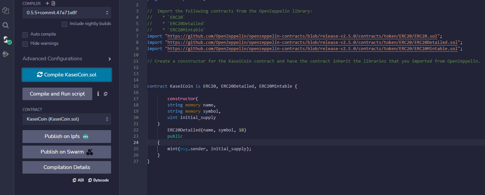
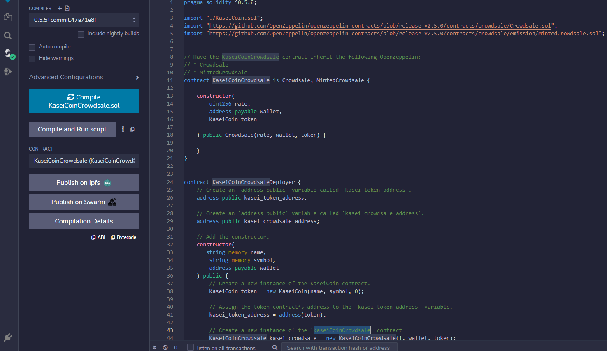
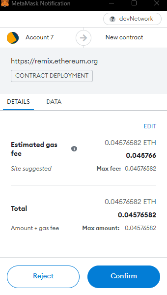
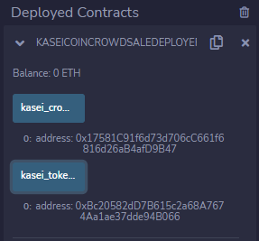
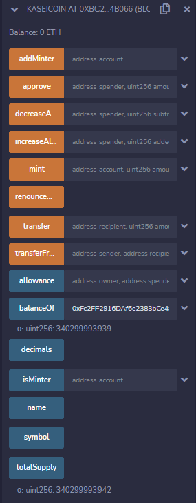
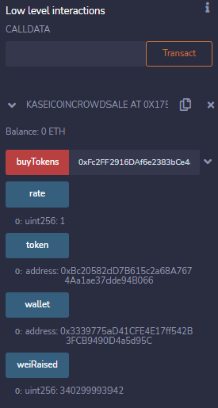

# Cryptocurrency_Crowdsale
This project creates a new cryptocurrency that is ERC-20 compliant and is mintable via an OpenZeppelin smart contract. Below is a preview of the functioning application running on Injected Provider Metamask.

---

## Successful Compile of KaseiCoin Contract:

---

## Successful Compile of KaseiCoin CrowSale and DeployCrowdSale Contract:

---

## Initiating Crowdsale and MetaMask Authorization:

---

## Deployed Contract:

---

## Buying Tokens:

---

## GIF of buying Tokens:

---

## Technologies

This analysis uses Solidity and the following libraries:
* [Solidity](https://docs.soliditylang.org/en/v0.8.17/) - Solidity is an object-oriented, high-level language for implementing smart contracts.
* [OpenZepplen](https://github.com/OpenZeppelin/openzeppelin-contracts) - OpenZepplen is a library for secure smar contract development.

---

## Installation Guide and Usage

To run this app please follow these steps:

1. Clone the the Cryptocurrency_Crowdsale repository to your local machine.

2. Open [Remix](https://remix.ethereum.org/)

3. Upload KaseiCoin.sol into your Remix file editer.

4. Compile the solidity code using version .5.5

5. Deploy the smart contract to the Remix VM or Injected Provider Metamask.

6. Use the buy token function to purchase tokens from the contract.

7. Use the weiRaised, and TotalSupply functions to ensure the code ran correctly.

---

## Contributors

Derick Decesare | [LinkedIn](https://www.linkedin.com/in/derickdecesare/) | derick.decesare@gmail.com

---
